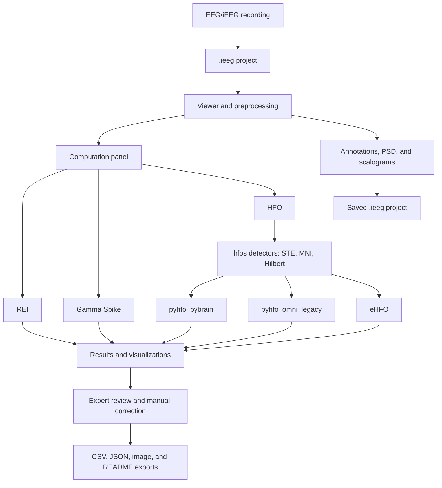

# iEEG Tool

> [!WARNING]
> **Work in progress.** This software is under active development and has not
> been validated as a medical device.

## What is this software?

iEEG Tool is a desktop application for computing, visualizing, and reviewing
quantitative analyses of intracranial EEG recordings.



Available computations are **Recruitment Energy Index (REI)**, **Gamma Spike**,
and **High-Frequency Oscillation (HFO)** analysis. HFO candidate detection
follows Omni-iEEG's STE, MNI, and Hilbert pipeline, implemented through the
`HFODetector` package. Candidates are then classified through the
`pyhfo_pybrain`, `pyhfo_omni_legacy`, or `eHFO` route. The sections below
describe each algorithm.

The viewer provides montage and rereferencing tools, bad-channel management,
display filters, annotations, PSD, scalograms, project saving, result
visualization, manual event review, and export.

The complete interface and workflow documentation is in the
[User Guide](https://m2b3.github.io/I_EEG/user_guide.html), also available from
**Help > User Guide** inside the application.

## Included analysis algorithms

### Recruitment Energy Index (REI)

REI ranks channels using spectral changes around seizure onset and their
recruitment delay. This implementation adapts
the open `IEEG_EI` implementation; it is a review aid rather than a clinical
conclusion.

References:

- [Bartolomei, Chauvel & Wendling (2008), *Brain*](https://doi.org/10.1093/brain/awn111)
- [`allucas/IEEG_EI`](https://github.com/allucas/IEEG_EI)

### Gamma Spike

Gamma Spike detects interictal spikes, estimates their boundaries, measures
preceding 30-100 Hz activity, and separates gamma-positive from non-gamma
spikes. The application contains a Python translation of the Lab-Frauscher
MATLAB workflow and uses the Janca Hilbert-envelope spike detector.

References:

- [`Lab-Frauscher/Spike-Gamma`](https://github.com/Lab-Frauscher/Spike-Gamma)
- [Janca et al. (2015), *Brain Topography*](https://doi.org/10.1007/s10548-014-0379-1)

### High-Frequency Oscillations (HFO)

HFO analysis uses the STE, MNI, and Hilbert candidate-detector pipeline
integrated by Omni-iEEG. The detector implementations come from the
`HFODetector` package; Omni's integration and parameterization are adapted here
to process the recording already loaded in memory. The resulting candidates
are passed to one of three selectable classification routes:

- `pyhfo_pybrain` (default): native-sampling pyHFO/pyBrain route, 80-500 Hz
- `pyhfo_omni_legacy`: Omni-compatible pyHFO route, 80-300 Hz at 1000 Hz
- `eHFO`: Omni-compatible eHFO route, 80-300 Hz at 1000 Hz

The classifiers distinguish artifacts, non-spike HFOs, spike-HFOs, and, for the
eHFO route, eHFO and spike-eHFO events. Results remain available for expert
review and manual correction.

References:

- [`HFODetector` candidate-detector package](https://pypi.org/project/HFODetector/)
- [`roychowdhuryresearch/pyHFO`](https://github.com/roychowdhuryresearch/pyHFO)
- [pyHFO `pyBrain` branch](https://github.com/roychowdhuryresearch/pyHFO/tree/pyBrain)
- [`Omni-iEEG/Omni-iEEG`](https://github.com/Omni-iEEG/Omni-iEEG)

## Installation

Use a 64-bit installation of **Python 3.10 or 3.11**. Python 3.11 is
recommended. Install [Git](https://git-scm.com/install/) and
[Python](https://www.python.org/downloads/) first.

Clone the repository and enter its folder:

```bash
git clone https://github.com/m2b3/I_EEG.git
cd I_EEG
```

If you downloaded a ZIP instead, extract it and open a terminal in the extracted
`I_EEG` folder.

### Windows PowerShell

Create the virtual environment **before** installing the requirements:

```powershell
py -3.11 -m venv .venv
.\.venv\Scripts\python.exe -m pip install --upgrade pip
.\.venv\Scripts\python.exe -m pip install -r requirements.txt
```

Using the venv's Python directly avoids PowerShell activation-policy errors.
Launch the application with:

```powershell
.\.venv\Scripts\python.exe main.py
```

### macOS

Create a separate, machine-local environment. Do not copy `.venv` between
Windows and macOS.

```bash
python3.11 -m venv .venv
./.venv/bin/python -m pip install --upgrade pip
./.venv/bin/python -m pip install -r requirements.txt
./.venv/bin/python main.py
```

If your Python 3.11 command is named `python3`, use that instead of
`python3.11` when creating the venv.

## HFO files and downloads

A normal Git clone includes the five required classifier checkpoints:

```text
app/computation/hfo/checkpoints/pyhfo_legacy_binary/model_a.tar
app/computation/hfo/checkpoints/pyhfo_legacy_binary/model_s.tar
app/computation/hfo/checkpoints/ehfo/artifacts.pth
app/computation/hfo/checkpoints/ehfo/spikes.pth
app/computation/hfo/checkpoints/ehfo/eHFOs.pth
```

No separate model download is normally required. If any file is missing, get it
from the project's
[HFO checkpoint folder](https://github.com/m2b3/I_EEG/tree/main/app/computation/hfo/checkpoints)
or clone the repository again.

`HFODetector` is also required for HFO candidate detection. It is installed
automatically by `requirements.txt`; its package page is
[here](https://pypi.org/project/HFODetector/).

After installation, verify the environment on Windows:

```powershell
.\.venv\Scripts\python.exe -m pip check
.\.venv\Scripts\python.exe -c "from HFODetector import hil, mni, ste; import PySide6, mne, pyqtgraph, torch, torchvision, skimage, safetensors; print('dependency check ok')"
```

On macOS, use `./.venv/bin/python` in place of
`.\.venv\Scripts\python.exe`.

For a comprehensive cross-platform check of the imports, bundled HFO
checkpoints, and Qt main window, run:

```bash
./.venv/bin/python check_environment.py
```

## Updating an existing installation

After pulling a newer version, reinstall the requirements because dependencies
may have changed:

```bash
git pull --ff-only
```

Windows:

```powershell
.\.venv\Scripts\python.exe -m pip install -r requirements.txt
```

macOS:

```bash
./.venv/bin/python -m pip install -r requirements.txt
```
