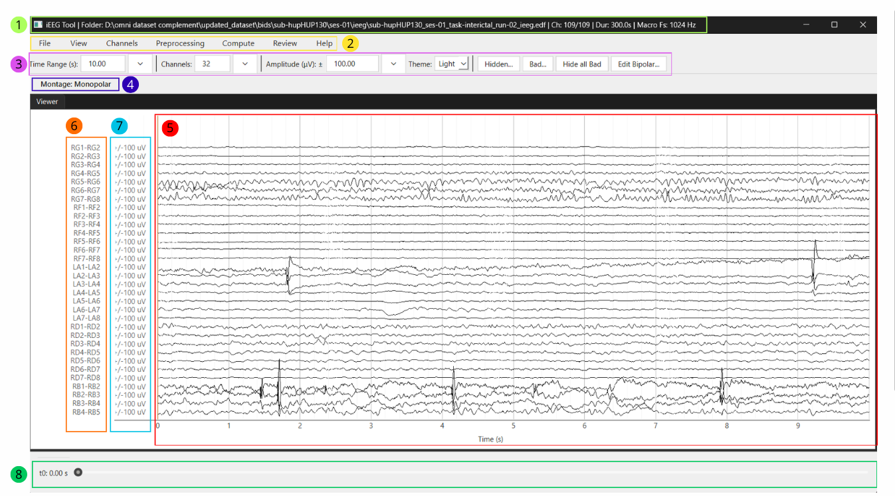

# User Guide

## 1. Getting started

### 1.1 Create a New Project

To start a new project, select File > New Project....

1. Select the raw EEG/iEEG recording
2. Choose where to save the `.ieeg` project file
3. Click Confirm

The project is linked to the selected raw recording.

Supported recording formats: `.edf` ; `.bdf` ; `.fif` ; `.vhdr` ; `.set` ; `.cnt`

### 1.2 Open an Existing Project

To reopen a previously saved project, select File > Open Project... and choose an existing .ieeg project file.

The application restores the saved project state (see Section – Save).

---

## 2. Main Window

### 2.1 Overview

1 - Window title and recording summary (file path, selected/total channels, duration and sampling rates)

2 - Menu bar (see Section 2.2)

3 - Toolbar (see Section 2.3)

4 - Current montage/reference indicator

5 - Signal viewer displaying EEG/iEEG traces (see Section 3)

6 - Channel labels

7 - Amplitude axis (µV)

8 - Time navigation bar 

### 2.2 Menu Bar

The menu bar provides access to the application's main functions.

- **File**: **Create**, **open**, **save** and **close** projects, or **exit** the application.
- **View**: Explore the recording more in depth using tools such as **zoom** and **scalogram mode**.
- **Channels**: Manually organize channel groups (e.g., micro vs. macro). By default the interface labels every channels as macro.
- **Preprocessing**: Configure the signal representation by selecting the montage/reference, applying display filters, and inspecting the power spectrum. 
- **Compute**: Run analysis algorithms from the computation panel ( Recruitment Energy Index-REI, gamma spikes, hfos; see Section 6)
- **Review**: Inspect and manage manual annotations 
- **Help**: Open the user guide and the keyboard shortcut summary.

### 2.3 Toolbar 

The toolbar provides quick access to the main display settings.

- **Time Range (s)**: number of seconds displayed in the viewer
- **Channels**: number of channels displayed simultaneously
- **Amplitude (µV)**: vertical scaling of the dispayed signal. This affects only the visualization and does not modify the raw data or computation results.

For these three settings, you can either enter a value directly or choose one from the drop-down menu.

Additional controls include:

- **Theme**: switch between Light and Dark interface themes
- **Hidden...**: review and restore hidden channels
- **Bad...**: review and unmark bad channels
- **Hide all Bad**: hide all channel currently marked as bad
- **Edit Bipolar...**: edit the bipolar montage when bipolar mode is active (See section 5)

## 3. Exploring the Recording
### 3.1 Navigation
#### 3.1.1 Channel Navigation

Move vertically through the channel list by:

- Scrolling the mouse wheel over the signal viewer.
- Pressing **Up Arrow** or **Down Arrow**.
- Holding **Shift** while pressing the arrow keys to move faster.
- Holding **Ctrl** while pressing the arrow keys to move much faster.

#### 3.1.2 Time navigation

Use the navigation bar below the signal viewer to move through the recording.

Keyboard shortcuts:

- **Left Arrow** and **Right Arrow** to move backward or forward
- **Shift + Left Arrow** and **Shift + Right Arrow** to move faster
- **Ctrl + Left Arrow** and **Ctrl + Right Arrow** to move much faster

### 3.2 View Menu
#### 3.2.1 Zoom Selection

Use **View > Zoom Selection** to zoom directly into a time and channel region.

1. Press and hold the **left mouse button**
2. Drag a rectangle over the region you want to inspect
3. Release the mouse button

The viewer zooms into the selected time range and channel range. Press **Escape** to cancel before applying the zoom.

Double left-click in the viewer to go back one zoom step.

Use **View > Reset Zoom** to return to the view that was active before the zoom sequence started.

#### 3.2.2 Scalogram Mode

Use **View > Scalogram Mode** to open a time-frequency view from one channel and one selected time interval.

1. Click **View > Scalogram Mode**
2. Drag horizontally on the channel you want to inspect
3. Release the mouse button

The scalogram window shows the selected channel context, raw signal, scalogram image, frequency-range slider, and hover readout. Very short selections are ignored.

Press **Escape** to cancel scalogram mode before opening a window.

## 4. Managing Channels

### 4.1 Micro/Macro Groups

By default the interface categorises every channels as Macro. The user must manually change the label of the micro channels. 

Use **Channels > Channel Groups...** to set channels as macro or micro.

1. Select one or more channel rows
2. Click **Set selected to Micro** or **Set selected to Macro**
3. Click **OK**

Channel groups control macro/micro styling and group-aware review tools.

### 4.2 Selecting Channels

To select one channel, left-click the trace or its label.
To select several channels:

- **Ctrl + click** adds or removes one channel
- **Shift + click** selects a range
- **Ctrl + Shift + click** adds a range to the current selection

Selected channels are highlighted in the viewer.

### 4.3 Hidden Channels

To hide one or more channels, right-click a selected trace and choose **Hide**.

To restore hidden channels, click **Hidden...** on the toolbar.

Hidden channels disappear from the visible display but are not deleted from the recording.

### 4.4 Bad Channels

To mark one or more channels as bad, right-click a selected trace and choose **Mark as bad**.

If all selected channels are already marked as bad, the context menu instead offers **Unmark as bad**.

To review or unmark bad channels, click **Bad...** on the toolbar. From the dialog, you can unmark individual channels or clear all bad-channel markings.

Bad channels are excluded from review-related computations and from automatic montage generation.

---

## 5. Preprocessing 

### 5.1 Montage / Reference

Use **Preprocessing > Montage / Reference** to switch reference mode.

Available options:

- **Monopolar**: shows each channel as imported
- **Bipolar**: builds an automatic bipolar montage and displays `Channel 1 - Channel 2`
- **Average**: subtracts the shared average from each channel
- **Median**: subtracts the shared median from each channel
- **Common Reference...**: subtracts one chosen physical channel from each displayed channel

Average and Median exclude bad channels from the reference pool and “Bad segment” samples are masked while calculating the shared reference. Hidden channels remain in the pool

#### Automatic Bipolar Montage

When **Bipolar** is selected, the application immediately builds and applies
an automatic bipolar montage. It extracts the electrode prefix and contact
number from each channel label, groups contacts by electrode, sorts them by
number, and pairs only consecutive contacts within the same electrode. For
example, `A1`, `A2`, and `A3` produce `A1-A2` and `A2-A3`.

Labels that cannot be parsed and contacts without a consecutive neighbor are
skipped. Channels already marked as bad are also excluded when the automatic
montage is generated. If no valid pairs can be created, the application shows
a warning. If only some channels are skipped, it displays a message listing
them. If the imported labels already look bipolar, the application asks for
confirmation before applying another bipolar derivation.

Bipolar mode performs true re-referencing rather than changing labels only.
Each displayed bipolar trace is calculated as **Channel 1 minus Channel 2**.
Hiding a displayed bipolar channel removes that derived trace from the viewer.
Bad channels remain visible unless they are hidden; use **Hide all Bad** to
remove them from view. Hiding a source channel does not exclude it when a new
automatic montage is generated.

### 5.2 Edit Bipolar Montage

The toolbar **Edit Bipolar...** button becomes visible when bipolar mode is active.

The editor lets you:

- change Channel 2 in automatic pairs
- add manual pairs
- restore the default automatic montage
- apply edits with **OK** or discard them with **Cancel**

#### Validation and Warnings

The editor validates all pairs before applying the montage. **Channel 2 must be
different from Channel 1**, and every bipolar channel name must be unique. If
either check fails, the montage is not changed. Channels marked as bad are not
available when choosing channels for edited pairs.

If Channel 1 and Channel 2 have recognizable labels but belong to different
electrode groups, the editor displays a **Cross-electrode bipolar pairs**
warning. Choose **Cancel** to leave the current montage unchanged or **Keep
edit** to apply the cross-electrode pair intentionally. This warning preserves
editing flexibility while flagging an unusual configuration.

### 5.3 Display Filters

Use **Preprocessing > Display Filters...** to show or hide the display-filter
controls above the signal viewer.

Use **Scope** to choose which filter profile to edit:

- **All** applies the same settings to Macro and Micro channels.
- **Macro** changes only the Macro profile.
- **Micro** changes only the Micro profile.

Each profile contains **High Pass (Hz)**, **Low Pass (Hz)**, and a **Notch**
choice: **Off**, **50 Hz + harmonics**, or **60 Hz + harmonics**. The high-pass
and low-pass controls are numeric and cannot be empty. Enter `0` to disable the
corresponding cutoff.

Click **Apply filters** to save the displayed values to the selected scope.
Click **Back to default** to clear the selected scope's filters.

Each active cutoff must be below the recording's Nyquist frequency. When both
cutoffs are active, the high-pass value must be lower than the low-pass value.

Display filters are non-destructive: the original recording is never modified.
The active reference is applied first, followed by the appropriate Macro or
Micro filter profile. For responsive browsing of large recordings, the viewer
reads the visible interval with extra padding, applies the filters, and then
crops the padding before plotting.

The PSD panel applies the same Macro and Micro display-filter profiles to the
selected PSD interval. Computation algorithms have separate preprocessing
rules: display high-pass and low-pass values are not automatically reused, and
the selected notch mode is reused only where stated in the relevant computation
section.

### 5.4 Power Spectrum

Use **Preprocessing > Power Spectrum** to inspect power spectral density (PSD)
over a chosen recording interval. Enter a start and stop time in the interval
dialog. The interval must remain inside the recording, and the stop time must
be later than the start time. The PSD opens as a tab beside the main viewer.

#### Macro and Micro panels

The PSD tab is divided into independent **Macro** and **Micro** panels. Channel
membership comes from **Channels > Channel Groups...**. Channels are assigned
to Macro by default, so the Micro panel remains empty until at least one channel
is assigned to Micro. If channel-group assignments change while the PSD tab is
open, the two panels are refreshed automatically.

In Bipolar montage, each displayed bipolar pair is placed in the same PSD group
as its first source channel (Channel 1). This keeps the derived channel in one
panel even if a manually edited pair crosses Macro and Micro groups.

Each group has its own:

- **Excluded channels** list on the left
- **Displayed channels** list on the right
- PSD plot at the bottom
- channel selection, inclusion/exclusion controls, and zoom state

Macro and Micro channels are processed with their corresponding active display
filter profiles before the PSD is calculated. The two panels can therefore show
different filtered spectra for the same interval. PSD values are displayed in
**dB/Hz** against frequency in **Hz**.

#### Displaying and selecting PSD curves

All channels in each group are included in its plot by default. This includes
channels hidden from the main viewer and channels marked as bad. Excluding a
channel from a PSD plot only changes the PSD tab; it does not hide the channel
in the main viewer or change its Macro/Micro assignment.

- Select one or more channels under **Displayed channels**, then click `<<` to
  move them to **Excluded channels**.
- Select channels under **Excluded channels**, then click `>>` to return them
  to **Displayed channels**.
- **Exclude all** and **Include all** operate only on the corresponding Macro
  or Micro panel.
- Click a displayed channel name or its curve to make it the active channel.
  Its curve and list label are emphasized.
- Each plot can be zoomed independently. Double left-click inside a plot to
  restore that plot's full default range.

Bad channels remain visible in red. Use **Mark selected as bad** or
**Unmark selected as bad** on selected entries in either list to update the
application-wide bad-channel state. A selected bad channel is shown with a
thicker red curve.

#### Plot Interaction

The Macro and Micro PSD plots support PyQtGraph mouse controls for zooming and
panning. Each plot keeps an independent view, and double left-clicking inside a
plot restores its full default range. These actions change visualization only;
they do not recalculate the PSD or modify computation results.

The PyQtGraph context menu is disabled in the current PSD panels, so its
built-in auto-range and export options are not available.

---

## 6. Compute

### 6.1 Open and Use the Computation Panel

Open the panel with **Compute > Open Computation Panel**. You can also select
channels in the viewer, right-click the selection, and choose
**Open Computation Panel**. The panel can be docked, floated, moved, or resized.

The panel analyzes the recording currently open in the application; it does not open a separate data file.

#### Panel Structure

The panel has four main sections:

- **Algorithm**: select **REI**, **Gamma spikes**, or **HFO**.
- **Channels**: choose the channels to analyze.
- **Time**: define the analysis interval and algorithm-specific parameters.
- **Output**: run or cancel an analysis, import results, open result views, and
  export results.

The **Time** and **Output** controls change with the selected algorithm.

#### Channel Selection

The **Channels** list defines the analysis input. Confirm it before every run,
especially after changing the montage or reference. Use:

- **All** to replace the list with all non-bad channels
- **Macro** or **Micro** to replace it with the non-bad channels in that group
- **Add...** to search for and add channels
- **Remove selected** or **Clear** to remove channels

When a run starts, the selected channels are extracted using the montage or reference active at that moment. Confirmed bad channels are not available for selection. Display high-pass and low-pass filters are not applied unless an algorithm explicitly defines them as part of its own preprocessing.

#### Shared Output, Import, and Export Controls

The **Output** section always contains the run control and **Import results...**.
Each algorithm shows its own cancel button while processing. Review and export buttons become available after a successful run or import.

To restore results, first load the matching recording and montage. Click
**Import results...** and select a folder previously exported by the
application. The algorithm is detected automatically. Available summaries,
review data, metadata, and viewer markers are restored. Import is rejected when
required files are missing or the recording, channels, or montage are
incompatible.

Use the export button shown for the selected algorithm. The application asks before replacing existing result files.

### 6.2 Recruitment Energy Index (REI)

#### Definition, Origin, and Validation

The Recruitment Energy Index (REI) estimates how early and strongly each channel becomes involved during seizure onset. It compares ictal
high-frequency energy with baseline activity, combines this energy change with the estimated recruitment time, and assigns each channel a normalized score and rank. A higher score indicates earlier and stronger recruitment relative to the other analyzed channels. REI is a review aid and should be interpreted together with the EEG/iEEG traces and clinical context.

This implementation was adapted from Lucas A.'s
[IEEG_EI project](https://github.com/allucas/IEEG_EI), a Python interface for calculating EI from iEEG.org recordings. It draws on the EI method introduced by [Bartolomei et al. (2008)](https://doi.org/10.1093/brain/awn111), which combines high-frequency activity at seizure onset with the relative timing of each channel's involvement.

No numerical parity with the source implementation or clinical-validation results are currently documented for this GUI implementation.

#### Time Input

Enter **Seizure onset** and **Seizure offset**, then check the baseline and ictal windows. Click **Use default windows** to set:

- baseline: 70 to 10 seconds before seizure onset
- ictal: 5 seconds before to 20 seconds after seizure onset

All windows must be non-empty and remain inside the recording. Seizure offset must be after seizure onset, and the ictal window must end no later than the seizure offset. REI does not impose a minimum seizure duration.

#### Advanced Parameters and Preprocessing

Bipolar montage is recommended. If another montage is active, the application lets you switch to Bipolar, continue with the current montage, or cancel.

REI excludes confirmed bad channels and ignores the display high-pass and low-pass filters. It applies a zero-phase fourth-order Butterworth bandpass; the default range is 60-140 Hz. Use **Advanced parameters...** to change this range.
The active notch setting is used when enabled. 

#### Run and Outputs

Click **Run REI**. When the analysis finishes, the main viewer displays the REI rank beside each analyzed channel. Channel labels are color-coded by normalized
REI score, from orange for lower scores to green for higher scores. An orange
tick on each trace marks the estimated recruitment time when it falls inside
the visible time window. Channels excluded from the analysis do not receive an
REI rank, score color, or recruitment marker.

Use:

- **Open REI summary** for channel scores, ranks, peak high-frequency energy, and recruitment delays
- **Open REI heatmap** for high-frequency energy around seizure onset, sorting, and top-channel controls
- **Export REI results** to save `rei_summary.csv`, `rei_heatmap.csv`,
  `rei_heatmap.png`, `rei_metadata.json`, and `README.txt`

### 6.3 Gamma Spikes

#### Definition, Origin, and Validation

Gamma-spike analysis detects interictal spikes and measures associated gamma
activity. Events are classified as gamma or non-gamma spikes for channel-level
and event-level review.

The implementation is a Python translation of the project's original MATLAB
spike-gamma workflow and uses the Janca Hilbert-envelope method for candidate
spike detection. The translated core was checked against the original
MATLAB/Python 2 behavior, and Brainstorm was used as an external comparison
during validation. The segmented long-recording pipeline was then checked for
consistency with that reference workflow. These are implementation checks, not
clinical sensitivity or specificity studies.

#### Time Input

Enter the analysis start and end times. The full recording is selected by
default.

#### Run and Outputs

Click **Run Gamma Spike Detector**. The detector processes the interval in
10-minute chunks with 10 seconds of context, merges detections once, and then
calculates spike boundaries and gamma measurements channel by channel. This
limits memory use on long recordings.

The analysis uses the active montage and notch setting but not the display
high-pass or low-pass filters. Progress and estimated remaining time appear in
the status area. Click **Cancel gamma run** to stop an active run.

When the analysis finishes, use:

- **Open channel-level summary** for spike counts, gamma-spike rate, and mean
  gamma measurements
- **Open spike grid** for raw traces, spike boundaries, gamma windows,
  time-frequency views, and manual event classification
- the **non-gamma** and **gamma** visibility controls to show or hide event
  markers and timeline entries
- **Export gamma results** to save `gamma_channel_summary.csv`,
  `gamma_spike_events.csv`, `gamma_metadata.json`, and `README.txt`

Per-spike heatmaps are not exported because they can create very large folders.

### 6.4 High-Frequency Oscillations (HFOs)

#### Definition, Models, and Validation

HFO analysis detects candidate high-frequency events and classifies them for
manual review. The three models mainly differ in their source implementation,
validated frequency range, sampling requirements, and classifier.

The model sources are the
[pyHFO pyBrain branch](https://github.com/roychowdhuryresearch/pyHFO/tree/pyBrain)
and [Omni-iEEG](https://github.com/Omni-iEEG/Omni-iEEG/tree/master/omni_ieeg).

- **pyhfo_pybrain-80-500 Hz** is the default. It preserves the native sampling
  rate and uses the original pyHFO Model A and Model S classifiers. Validation
  matched 53/53 Zurich15 and 500/500 HUP134 candidate-pool labels. In the full
  Zurich15 route, events and labels matched for STE (1/1), MNI (36/36), and
  Hilbert (43/43).
- **pyhfo_omni_legacy-80-300 Hz** reproduces Omni's legacy pyHFO route. It
  requires a sampling rate of at least 1000 Hz and processes at 1000 Hz. On the
  Zurich10 candidate pool, 611/611 labels matched and the maximum recorded score
  difference was 0.0.
- **eHFO-80-300 Hz** reproduces Omni's three-model artifact, spike, and eHFO
  classifier using the official checkpoints. It has the same sampling
  requirement as the Omni legacy route. On Zurich10, 611/611 labels matched,
  with exact feature and score agreement.

These are technical parity tests against each model's source implementation,
not clinical performance studies. They apply only to the stated validated
configuration; changing the band or detector settings creates an unvalidated
configuration.

#### Time Input

Enter the analysis start and end times. The full recording is selected by
default. This input behaves the same for all three models.

#### Advanced Parameters and Preprocessing

Select a model and compatible band preset. The default band is 80-500 Hz for
`pyhfo_pybrain` and 80-300 Hz for both Omni models. **Ripples 80-250 Hz** and
**Custom** are available for all models; **Fast ripples 250-500 Hz** is available
only for `pyhfo_pybrain`.

All models use the same **Advanced parameters...** interface. Select one or more
candidate detectors—STE, MNI, or Hilbert—and edit their parameters if needed.
At least one detector must remain selected. Click **Save** to apply advanced
changes. The high frequency must remain below the effective Nyquist limit.

The analysis uses the active montage and notch setting, not the display
high-pass or low-pass filters. Candidates that exceed the maximum duration or
fall inside the analysis-edge padding are excluded before classification and
counted in the metadata.

#### Run and Outputs

Click **Run HFO Detector**. All models use the same background-processing,
progress, estimated-time, and cancellation interface.

When the analysis finishes, use:

- **Open HFO summary** for channel-level candidate and class counts
- **Open HFO event grid** for raw and filtered traces, spectrograms, detector
  information, classifier propositions, and manual review
- the class visibility controls to show or hide **artifact**, **HFO**,
  **spkHFO**, **eHFO**, **spk-eHFO**, and **unclassified** events
- **Export HFO events** to save `hfo_channel_summary.csv`, `hfo_events.csv`,
  `hfo_metadata.json`, and `README.txt`

Manual classification does not overwrite the model's original proposition. A
deleted event is removed from active counts but retained in exported data for
traceability.

#### Shared Result Navigation

Gamma-spike and HFO results add event-visibility checkboxes beside the montage
label and a result timeline below the viewer. These controls only show or hide
results; they do not filter the EEG signal or change saved results.

The timeline covers the full recording and highlights the current viewer
window. Click a timeline event to jump to its channel and time. Click an event
marker in the viewer to open the corresponding review window.

---

## 9. Review Menu

### 9.1 Annotate

Use **Review > Annotate** to add annotations to the signal display.

1. Choose annotation type
2. Choose annotation scope
3. Add an optional note
4. Click **OK**
5. Drag on the signal display where you want to place the annotation

Annotation scopes:

- clicked channel
- selected channels
- all channels

Press **Escape** to cancel annotation mode before placing an annotation.

To modify an annotation from the viewer, right-click the annotation region and choose **Edit annotation...** or **Delete annotation**.

When annotations exist, the Annotations dock appears. From the list, you can click an annotation to jump to it or delete it from the plot context menu.

---

## 3. File Menu

### 3.1 Save

Use **File > Save** to save the current project.

The `.ieeg` project file saves:

- the linked raw file
- annotations
- hidden channels
- bad channels
- macro/micro channel groups
- an edited bipolar montage, ready for reuse after Bipolar is selected
- macro and micro display-filter settings
- display time range, visible-channel count, and amplitude scale
- the selected computation algorithm and channels
- REI seizure timing, baseline/ictal windows, and frequency settings
- gamma-spike and HFO analysis intervals
- HFO classifier, band, detector, and advanced-parameter settings
- the last REI result metadata, when available

The project file does not save:

- the active reference mode; a project reopens in Monopolar
- complete REI, gamma-spike, or HFO results
- the Light/Dark theme
- the main-viewer time position
- open docks, review grids, PSD/scalogram windows, or other secondary windows
- gamma/HFO event-filter checkbox selections

Complete computation results are stored in exported result folders rather than
inside the `.ieeg` project file. To recover those results and their viewer
markers, use **Import results...** with the matching exported folder.

### 4.2 Save As

Use **File > Save As...** if the project does not yet have a save path or if you want to save it as another file.

**Save As...** stores the same elements as **Save**, but in a new `.ieeg` project file.

### 4.3 Close Project

Use **File > Close Project** to close the current project while keeping the application open.

If there are unsaved changes, the application asks whether to save, continue without saving, or cancel.

### 4.4 Exit

Use **File > Exit** to quit the application.

If there are unsaved changes, the application asks what to do before closing.

---

## 10. Help Menu

### 10.1 User Guide

Use **Help > User Guide** to open this guide from inside the application.

### 10.2 Shortcuts

Use **Help > Shortcuts** to open the keyboard and mouse shortcut list.

---

## 11. Practical Review Workflow

A common workflow is:

1. Create or open a project
2. Inspect the recording in **Monopolar**
3. Mark noisy or unusable channels as **bad**
4. Hide channels if needed for visual clarity
5. Switch reference mode if useful
6. Add annotations
7. Open the computation panel or PSD panel if needed
8. Run a computation or import a matching exported result folder
9. Review event classes and use the global timeline to navigate results
10. Export results when needed
11. Save the project regularly
