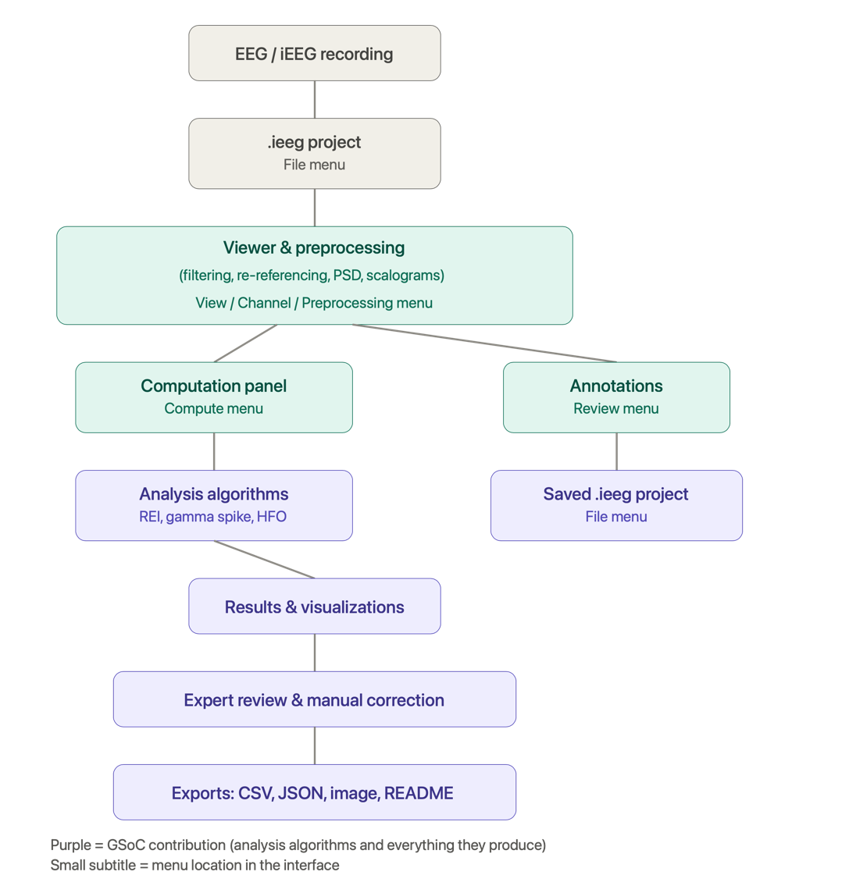
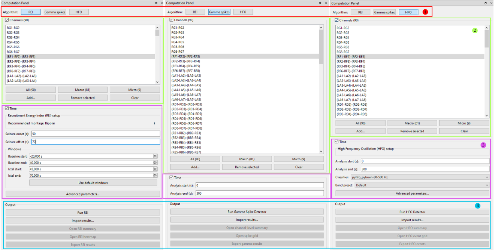
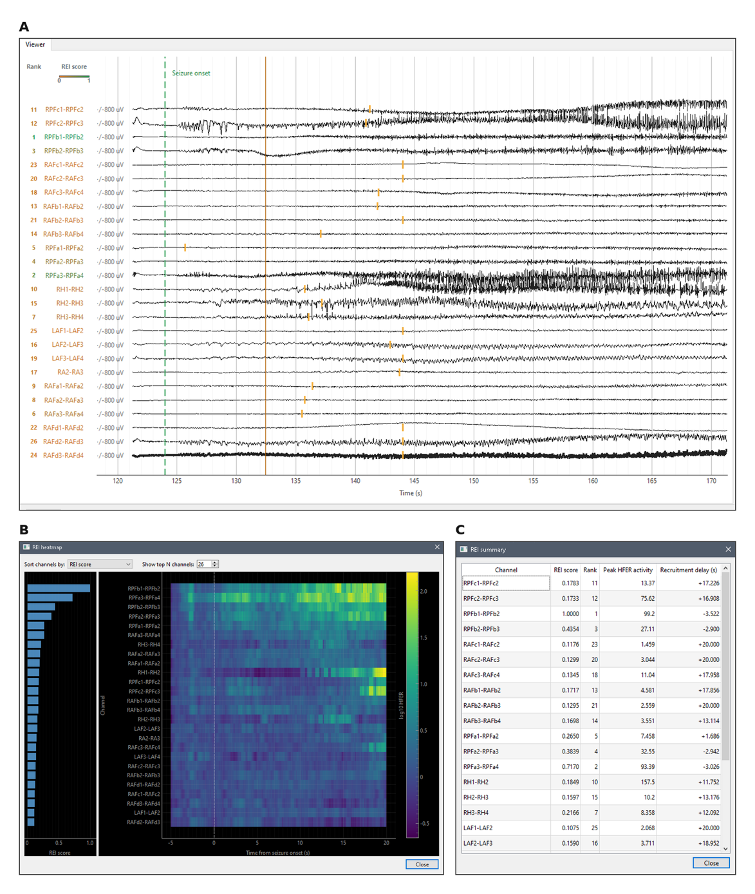
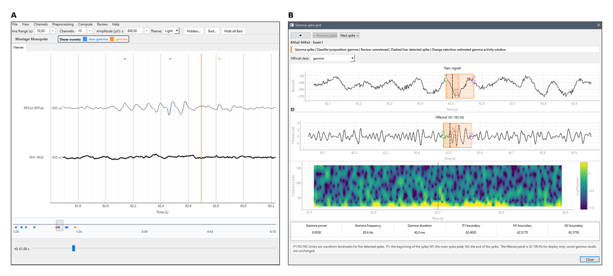
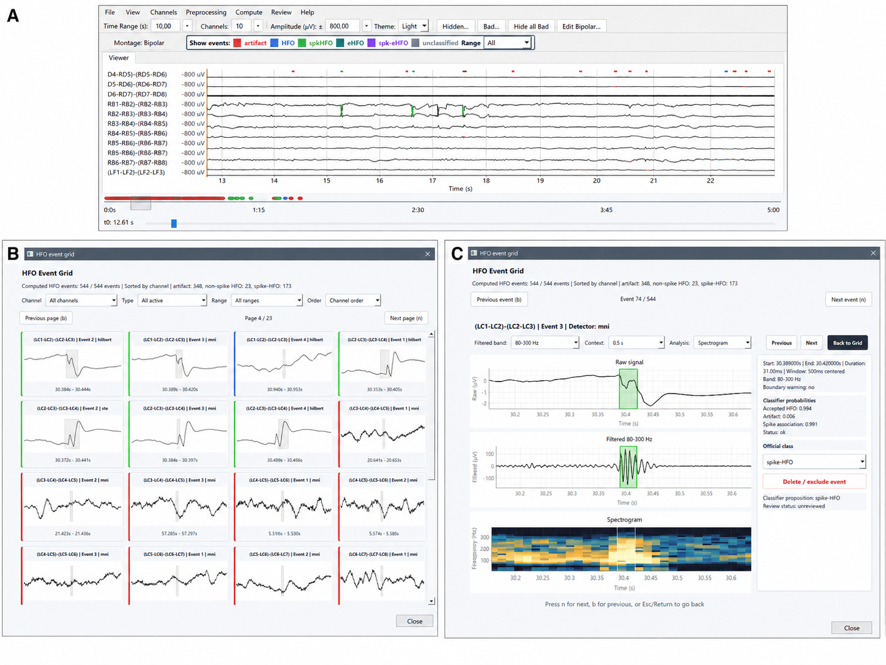

<!-- SPDX-FileCopyrightText: 2026 The Project Authors -->
<!-- SPDX-License-Identifier: AGPL-3.0-only -->

# GSoC Final Report

## Project information

**Title:** IEEG: Extending an Open-Source Platform for Semi-Automated Intracranial EEG Analysis

**By:** Eva Ozturk

**Mentors:** Maya Aderka, Suresh Krishna, Elie Bou-Assi

**Organisation:** INCF

**GSoC year**: 2026

**Repository**: [https://github.com/m2b3/IEEG](https://github.com/m2b3/IEEG)

**Project duration**: 14 weeks

## Introduction

### Clinical motivation

Epilepsy affects approximately 50 million people worldwide, and around one-third of patients continue to experience seizures despite appropriate antiseizure medication. For some individuals with drug-resistant epilepsy, resective surgery may offer the best chance of achieving seizure freedom \[1\]. Its success, however, depends on accurately identifying the epileptogenic zone: the brain region that must be removed to prevent seizures. Intracranial electroencephalography (iEEG) is an important tool for this localization during presurgical evaluation.

A central challenge is the scale and complexity of iEEG data. Recordings may span several days and include hundreds of channels, making exhaustive manual review both time-consuming and vulnerable to missed subtle patterns. Although computational methods have been proposed to support this process, many remain standalone research scripts that are difficult to incorporate into clinical workflows.

This project addresses that gap by extending an open-source desktop application for epilepsy research and expert review. Its overall goal is to make computational iEEG analyses easier to configure, inspect, validate, and reproduce within a unified interface.

### Project starting point

Before GSoC, the graphical user interface already supported EEG file loading, interactive signal visualization, navigation, zooming, annotation, filtering, montage and re-referencing options, power spectral density estimation, and scalogram visualization. Its modular architecture separated visualization, preprocessing, and annotation into distinct components, providing a strong foundation for further development. A computation panel had also been created as a placeholder for future analysis modules. However, no analysis algorithms were connected to it.

## My contribution

The aim of my GSoC project was to transform the existing foundation into a functional, semi-automated analysis environment by integrating three clinically relevant iEEG analysis methods:

- the Epileptogenicity Index;

- Gamma Spike analysis;

- high-frequency oscillation (HFO) analysis.

I connected these methods to the application’s data-processing pipeline and developed the interfaces required to configure analyses, inspect results, review detected events, and export reproducible outputs. I also improved large-recording performance, refined existing interface components, and expanded the project documentation.

*Figure 1. Diagram of the final software architecture.*

### 2.1 Shared Computation Infrastructure

The integrated algorithms were selected in consultation with clinicians, based on biomarkers commonly used or investigated in epilepsy research and presurgical assessment. Preference was given to methods with published scientific foundations and publicly available implementations.

The computation panel provides a common interface organized into four sections:

- Algorithm: selection of REI, Gamma Spike, or HFO analysis.

- Channels: selection of the channels included in the analysis.

- Time: definition of the recording interval and algorithm-specific advanced parameters.

- Output: controls for running or cancelling an analysis and importing, reviewing, or exporting its results.

*Figure 2. Computation panels for the three analysis modules.*

The controls adapt to the selected algorithm. Across all modules, bad channels are excluded automatically, the active montage is used, and preprocessing is defined independently from the viewer’s display filters. Computations run as background tasks with progress reporting and cancellation support, keeping the interface responsive.

Exports contain tabular results, analysis metadata, and a README defining the files, variables, and units. Previous results can be imported and reviewed without rerunning the computation.

All three analysis modules were functionally tested and compared with their corresponding reference implementations, focusing on agreement between computational outputs.

### 2.2 Recruitment Energy Index

#### Purpose and scientific basis

The Recruitment Energy Index (REI) ranks channels according to the strength and timing of their recruitment during a seizure. It combines high-frequency energy with recruitment delay relative to seizure onset. Higher scores indicate earlier and stronger recruitment within the analyzed channel set.

The module was adapted from Lucas A.’s open-source [IEEG_EI implementation](https://github.com/allucas/IEEG_EI) \[3\] of the Epileptogenicity Index method introduced by [Bartolomei et al. (2008)](https://doi.org/10.1093/brain/awn111) \[2\]. Because the integrated implementation differs from the original method, it was named Recruitment Energy Index to avoid implying exact equivalence.

#### Implementation

I adapted the reference implementation to work with the application’s channel selection, montage, and preprocessing systems. A dedicated configuration interface was developed for the user to define the seizure onset and offset, which initialize editable baseline and ictal windows. The module applies algorithm-specific preprocessing, including a zero-phase, fourth-order Butterworth band-pass filter with a default range of 60–140 Hz. This range can be changed through the advanced parameters.

#### Outputs

REI results are displayed through three complementary views:

- **Main viewer:** channel ranks + score-based label colors (green to orange), and markers indicating estimated recruitment times (orange ticks) (Figure 3A);

- **Channel summary:** REI scores, ranks, recruitment delays, and peak high-frequency energy values (Figure 3C);

- **Heatmap:** temporal high-frequency energy patterns across the analyzed channels, accompanied by a channel-score visualization (Figure 3B).

*Figure 3. REI outputs (A) main viewer showing REI-score color coding, and estimated recruitment-time markers relative to seizure onset; (B) heatmap temporal high-frequency energy across channels, sorted by REI score; (C) channel summary listing REI score, rank, peak high-frequency energy, and recruitment delay for each channel.*

### 2.3 Gamma Spike analysis

#### 2.3.1. Purpose and scientific basis

Gamma Spike analysis detects interictal spikes and measures associated activity in the 30–100 Hz band. A gamma spike is a detected spike classified by the source workflow as being accompanied by qualifying gamma-band activity; events that do not meet its criteria are classified as non-gamma. The resulting event- and channel-level measures support investigation of spike–gamma activity as a marker of epileptogenic tissue \[5\].

The module is a Python translation of the [Lab-Frauscher Spike-Gamma MATLAB workflow](https://github.com/Lab-Frauscher/Spike-Gamma) \[5\]. Within that workflow, candidate spikes are detected using the Janca Hilbert-envelope method \[4\] and subsequently undergo artifact and spindle rejection, boundary estimation, and gamma measurement \[5\].

#### 2.3.2. Implementation

The original MATLAB workflow was translated into Python and integrated into the platform. To process long recordings without loading the full interval into memory, I implemented segmented execution using 10-minute blocks. Each block includes up to 10 seconds of temporary context on either side to reduce filtering-edge effects. Only events within the central interval are retained, preventing duplicates when blocks are merged.

#### 2.3.3. Outputs

Results can be examined through three complementary views:

- **Recording level:** the main viewer and timeline show the location and classification of detected events (Figure 4A).

- **Channel level:** a summary reports spike counts, gamma-spike counts and proportions, mean gamma power, and mean gamma duration.

- **Event level:** a detailed review view displays the raw signal, 30–100 Hz activity, time–frequency representation, P1/N1/N2 boundaries, and gamma measurements (Figure 4B).

In the review grid, an expert can change the official class of an event. The original algorithmic classification is retained for traceability, while summaries and overlays follow the reviewed class.

*Figure 4. Gamma Spike outputs: (A) events in the main viewer and timeline; (B) detailed event review. Includes raw signal, 30–100 Hz activity, time–frequency representation, estimated P1/N1/N2 boundaries, gamma measurements, and expert classification controls.*

### 2.4 High-frequency oscillation (HFO) analysis

#### 2.4.1. Purpose and scientific basis

High-frequency oscillations are short oscillatory events investigated as potential biomarkers of epileptogenic tissue \[7,8\]. This module was the most technically substantial analysis component because it combined multiple candidate detectors and classification routes with different preprocessing, sampling, and output requirements.

The implementation builds on pyHFO \[6\] and its pyBrain models, as well as on the legacy pyHFO and eHFO pipelines provided through Omni-iEEG \[9\].

#### 2.4.2. Implementation

The HFO pipeline follows a two-stage design:

- **Candidate detection**: potential HFO events are identified using the Short-Term Energy (STE), Montreal Neurological Institute (MNI), or Hilbert detector. Users can enable one or several detectors and configure their parameters.

- **Event classification:** the resulting candidates are processed using one of three classification routes.

| Route | Processing | Output classes |
| --- | --- | --- |
| pyhfo_pybrain | Native sampling; normally 80–500 Hz; original pyHFO Model A and Model S | artifact, HFO, spike-HFO |
| pyhfo_omni_legacy | Resampled to 1,000 Hz; normally 80–300 Hz; Omni-compatible pyHFO route | artifact, HFO, spike-HFO |
| eHFO | Omni-compatible preprocessing with artifact, spike, and eHFO classifiers | artifact, HFO, spike-HFO, eHFO, spike-eHFO |

Separate preprocessing paths were implemented so that each route retains the frequency, sampling, feature-generation, and classification behavior of its reference workflow. The application includes and loads the two pyHFO checkpoints and three official eHFO checkpoints required by these classifiers.

The pyhfo_pybrain route operates at the recording’s native sampling rate and is limited by its Nyquist frequency. The Omni-based routes require input sampled at 1,000 Hz or above and process data at 1,000 Hz. Validation prevents unsupported frequency and sampling-rate combinations.

Users can select one or more candidate detectors and configure detector-specific thresholds, duration rules, merging criteria, minimum cycle counts, and epoch lengths. Standard ripple and fast-ripple presets are provided where compatible, together with an experimental custom frequency band. Parameters and model provenance are recorded with the results.

#### 2.4.3. Outputs

The three routes use a common review interface despite their different output classes. Events are displayed in the main viewer and timeline (Figure 5A), summarized by channel, and available in an event grid (Figure 5B). The detailed event view (Figure 5C) includes original and filtered signals, an FFT or spectrogram, event timing, detector provenance, model predictions, and classification probabilities where available.

Reviewers can change an event’s official class or exclude it from summaries and overlays. The original algorithmic or model classification and excluded candidates remain in the exported event table, preserving the complete path from candidate detection to expert decision.

*Figure 5. HFO outputs: (A) detected events in the main viewer and timeline; (B) HFO event grid for browsing and classification; (C) detailed event review. Includes raw and 80–300 Hz filtered signals, spectrogram representation, classifier probabilities, event classification, and expert review controls.*

### Cross-cutting improvements

Beyond the three analysis modules, I implemented several improvements that support the application as a whole.

**Visualization and performance.** Waveform rendering for large recordings was optimized through display-oriented downsampling that preserves local signal extrema, making short spikes remain visible even when long time windows are shown. Bounded caching for filtered signal segments, reuse of bipolar data where possible, and debounced timeline updates further reduce redundant processing during navigation.

**Channel handling and interface consistency.** Handling of macro- and microelectrode channels was improved across filtering, montages, the main viewer, PSD visualization, and the computation modules. Menu organization, navigation, computation-panel behavior, and event timelines were also refined to make analysis results easier to locate and inspect.

**Documentation.** The user guide was expanded with installation instructions, analysis workflows, parameter descriptions, figures, output definitions, and interpretation notes.

## 3. Technical challenges and decisions

**Handling large recordings without losing short events:** Long iEEG recordings create two distinct problems: rendering too many samples slows interaction, while loading and processing full recordings can exceed available memory. For visualization, simple stride-based downsampling risks omitting brief spikes, so an envelope-based approach that retains local minima and maxima was used instead, preserving transient events while reducing the number of rendered points. For Gamma Spike analysis, this same concern was addressed at the processing level with 10-minute blocks and short context windows on each side, which limit peak memory use while avoiding duplicated or edge-distorted events. HFO analysis still processes the selected interval in memory and remains the main target for future bounded-memory work.

**Preserving reference-specific algorithm behavior:** The integrated algorithms originated in independent projects with different assumptions about sampling rate, filtering, and model inputs, most notably for HFO analysis, where pyhfo_pybrain preserves native sampling while the Omni-compatible routes require input resampled to 1,000 Hz. A single universal preprocessing path would have silently changed the behavior of these reference workflows, so separate processing routes were implemented instead, each with explicit validation of sampling rate, frequency band, and model compatibility.

**Combining automated output with expert review:** Finally, the application needed to support manual correction without overwriting the automated result. Event records therefore distinguish the model's original proposition from the expert reviewed class: viewer overlays and summaries follow the reviewed decision, while the original classification remains available for traceability. A shared review interface was designed around this principle, adapting its available classes and measurements to Gamma Spike and each HFO route.

## 4. Remaining Work

Although the main analysis workflows are functional, further work is needed to improve scalability, reproducibility, usability, and clinical readiness.

### 4.1 Processing long recordings

Gamma Spike analysis already processes long recordings in overlapping 10-minute segments, avoiding the need to load an entire channel selection at once. However, the analysis remains computationally intensive: processing a 2.5-hour recording with approximately 100 channels may take around 55 minutes, depending on the hardware and number of detected events.

HFO analysis is currently the main memory bottleneck, since it loads the full selected interval and creates additional arrays during filtering, resampling, detection, and classification. For comparison, a single one-hour float64 array containing 100 channels sampled at 1,000 Hz requires approximately 2.9 GB of memory.

Future work should extend the segmented-processing strategy used for Gamma Spike to the HFO pipeline, and check for cancellation between detection and classification batches so long computations can be interrupted more quickly. The optimized pipeline should then be benchmarked across recording durations, channel counts, sampling rates, detectors, and classification routes. Runtime, peak memory use, disk use, event counts, classification agreement, and boundary differences should be recorded. This work will be considered complete when long HFO analyses can run within bounded memory while producing results equivalent to the existing pipeline on shorter reference recordings.

### 4.2 Configuration and usability

Additional parameters could be made editable while maintaining strict validation, including completing and validating custom HFO frequency bands and evaluating which Gamma Spike and HFO parameters can safely be exposed to users. Other planned interface improvements include adjustable per-channel amplitude scales; channel and time filters on the annotation panel; tighter integration between Gamma Spike/HFO review decisions and the annotation system; lazy loading or pagination for large event grids; clearer messaging about memory limits, estimated runtime, cancellation, and incomplete results; and simplified packaging and installation.

### 4.3 Longer-term development

Once the current algorithms are stabilized and validated against their reference implementations, the platform could be extended with additional biomarkers, such as newer Omni-iEEG event-classification models or the Connectivity Epileptogenicity Index. Longer-term research objectives include validation on independently annotated clinical datasets, automatic bad-channel detection, automatic seizure-onset/offset detection, and cortical visualization combining electrode coordinates with anatomical MRI data.

## 5. Code contribution

Comparing the pre-GSoC baseline (69134d5) with the [final commit](https://github.com/m2b3/IEEG), most contributions are in the computation package (app/computation/) and documentation (README.md and the [User Guide](https://m2b3.github.io/IEEG/user_guide.html)).

Beyond the computation package, the contribution touched files across the application: main_window.py and menus.py (wiring analyses into the main window and menus), viewer/plot.py and the new event_timeline.py (overlays and full-recording timelines), viewer rendering code (downsampling, caching, debouncing), project_io.py (computation and review state), requirements.txt (dependencies), and the bundled HFO model checkpoints.

The existing app/viewer/ and app/preprocessing/ components were modified and reorganized.

## Conclusion and lesson learned

Over 14 weeks, this project transformed an existing visualization application into an integrated environment for REI, Gamma Spike, and HFO analysis, connecting algorithm configuration, computation, visualization of results, expert review, and reproducible export within a single desktop interface, and establishing a shared architecture for adding and evaluating further iEEG analysis methods.

Beyond the code itself, the project was a substantial learning experience. Working directly with clinicians shaped how each module's outputs and review options were designed, including decisions on what to expose for editing and what to keep fixed to preserve algorithmic traceability. Reviewing and adapting third-party scientific code (MATLAB workflows, published detectors, pretrained classifiers) taught me to validate a reference implementation's assumptions before integrating it, rather than assuming a single preprocessing path would generalize across methods.

## References

- Shorvon SD. Epidemiology of epilepsy. In: Shorvon SD, Guerrini R, Cook M, Lhatoo SD, editors. Handbook of Clinical Neurology \[Internet\]. Vol. 139. Elsevier; 2016 \[cited 2026 May 12\]. p. 159–71. Available from: [https://www.sciencedirect.com/science/chapter/handbook/pii/B9780128029732000100](https://www.sciencedirect.com/science/chapter/handbook/pii/B9780128029732000100). doi:10.1016/B978-0-12-802973-2.00010-0.

- Bartolomei F, Chauvel P, Wendling F. Epileptogenicity of brain structures in human temporal lobe epilepsy: a quantified study from intracerebral EEG. Brain. 2008;131(7):1818–30. doi:10.1093/brain/awn111.

- Lucas A. IEEG_EI: Python GUI for calculating the Epileptogenicity Index on iEEG.org data \[Internet\]. GitHub; \[cited 2026 Aug 27\]. Available from: [https://github.com/allucas/IEEG_EI](https://github.com/allucas/IEEG_EI).

- Janča R, Jezdík P, Čmejla R, Tomášek M, Worrell GA, Stead M, et al. Detection of interictal epileptiform discharges using signal envelope distribution modelling: application to epileptic and non-epileptic intracranial recordings. Brain Topogr. 2015;28:172–83.

- Lab-Frauscher. Spike-Gamma: MATLAB workflow for interictal spike detection and gamma-band measurement \[Internet\]. GitHub; \[cited 2026 Aug 27\]. Available from: [https://github.com/Lab-Frauscher/Spike-Gamma](https://github.com/Lab-Frauscher/Spike-Gamma).

- Zhang Y, Ding Y, Duan C, et al. pyHFO: lightweight deep learning-powered end-to-end high-frequency oscillations analysis application \[Internet\]. GitHub; \[cited 2026 Aug 27\]. Available from: [https://github.com/roychowdhuryresearch/pyHFO](https://github.com/roychowdhuryresearch/pyHFO).

- Monsoor T, et al. Optimizing detection and deep learning-based classification of pathological high-frequency oscillations in epilepsy. Clin Neurophysiol. 2023;154:129–40. doi:10.1016/j.clinph.2023.07.012.

- Zhang Y, Lu Q, Monsoor T, Hussain SA, Qiao JX, Salamon N, et al. Refining epileptogenic high-frequency oscillations using deep learning: a reverse engineering approach. Brain Commun. 2022;4(1):fcab267. doi:10.1093/braincomms/fcab267.

- Omni-iEEG: a large-scale dataset and benchmark for HFO-based epileptogenic zone localization \[Internet\]. 2026. ICLR 2026.

## Acknowledgements

I would first like to sincerely thank my supervisor, Professor Suresh Krishna, for giving me the opportunity to take part in this project and allowing me to learn so much about computational neuroscience, artificial intelligence, and research overall. I am really grateful for the trust you put in me throughout this experience.

I would also like to thank the Google Summer of Code administrators for making this project possible and for their dedication and support in ensuring the successful completion of these projects.
